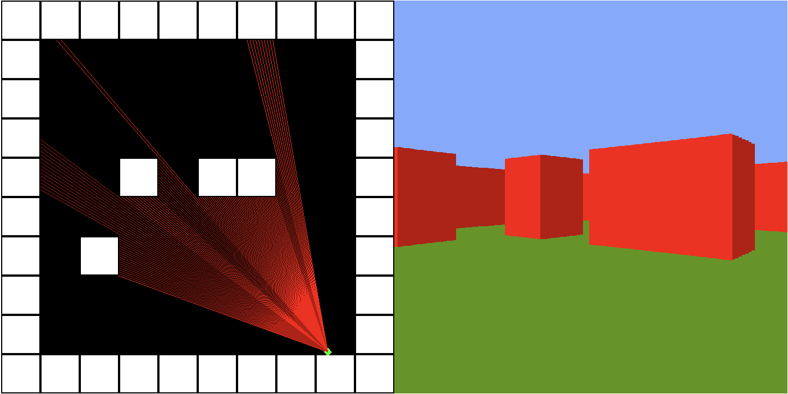

# RayCaster 

This project is a raycaster engine, used in games like Wolfenstein 3d, developed from scratch using the WGPU library in Rust.

RayCaster can run natively on most gpus supported by WGPU as well as on the browser.

Walls on the map can be created and deleted using left and right click respectively.

Try it out yourself! -> https://raycaster-834df.firebaseapp.com/

